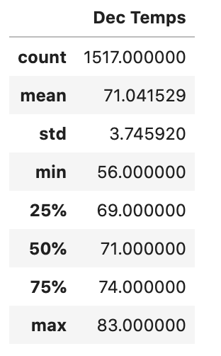

# surfs_up

## Overview of Analysis
In this analysis, I have researched the weather data from the Hawaiian island of Oahu in order to make an informed decision on whether or not opening a surf and ice cream shop would be sustainable year round.  This analysis specifically focuses on the months of June and December to capture the months with the highest and lowest temperature patterns.

## Results
From the analysis of June and December temperatures, I was able to come up with the following results:
- the average temperature for both months are above 70 degrees (June - 74.9 & Dec - 71)

- the highest temperature climbs as high as 85 in June and 83 in December, however the 75% percentile are upper 77 and 74, respectively so 80 degree days are not very common during these months.

- the lowest temperature gets down to 64 degrees in June and 56 degrees in December. Again, with lower quartile being 73 and 69 respectively, these lows do not occur very often.

 

## Summary
In summary, based on the analysis I've done on the temperatures in the months of June and December I believe that there is not much risk, weather-wise, in opening up a surf and ice cream shop. The temperatures during those months primarily fall within the 70 degree range making for perfect ice cream and shopping weather.